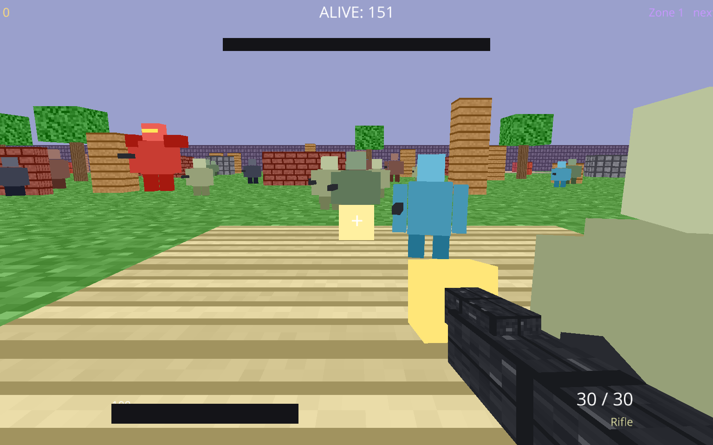

# 🌩️ Storm Royale

**Francis & Toby's own 3D battle royale.** Drop into the arena, grab a weapon, and
fight an **enormous army of 150 enemies** of every difficulty — from weak grunts all
the way up to giant **Juggernaut bosses**. A deadly storm keeps closing in, so stay
in the safe zone and be the **last one standing** for a **VICTORY ROYALE**.

Built in Python with [Ursina](https://www.ursinaengine.org/). Everything — the HD
pixel textures, the blocky enemies, and the music — is generated in code. No
external art or audio files.



## ▶️ Run it

```bash
pip install ursina numpy pillow
python battleroyale.py
```

## 🎮 Controls

| Input | Action |
|-------|--------|
| **Mouse** | Look around |
| **WASD** | Move |
| **Shift** | Sprint |
| **Space** | Jump |
| **Left click** | Shoot (hold for automatic) |
| **R** | Reload |
| **1 / 2 / 3** | Switch weapon (Rifle / Shotgun / Sniper) |
| **Scroll** | Cycle weapons |
| **M** | Mute / unmute music |
| **Enter / R** | Restart after the match ends |

## 🔫 Weapons

- **Rifle** — fast, accurate automatic fire. Your all-rounder.
- **Shotgun** — 7 pellets in a wide cone. Devastating up close.
- **Sniper** — one shot, one kill. Tiny spread, huge damage — aim carefully.

## 👾 Enemy difficulty tiers

All 150 enemies are drawn from seven distinct tiers, each with its own look,
speed, health and behaviour:

| Tier | HP | Notes |
|------|----|-------|
| **Grunt** | 30 | Weak, swarming cannon fodder |
| **Soldier** | 55 | Standard trooper |
| **Scout** | 34 | Very fast, hard to hit, strafes a lot |
| **Heavy** | 140 | Slow tank that soaks up damage |
| **Sniper** | 46 | Hangs back and hits hard from range |
| **Elite** | 240 | Fast *and* tough — a serious threat |
| **Juggernaut** | 900 | Giant **boss** with glowing eyes and a health bar |

Enemies chase, keep their distance, strafe, flee the storm, and shoot back with
tier-based accuracy.

## 🌪️ The storm

A translucent storm dome shrinks through **6 phases**. Anything caught outside
the safe zone takes damage that ramps up over the match — enemies included. The
HUD warns you when you're outside the zone and shows the current phase and the
countdown to the next shrink.

## 🎵 Music

Real game soundtracks are copyrighted, so Storm Royale plays **original chiptune
battle music** written just for it. The track adapts to the match — a calm drop
theme, a tense battle theme when enemies are near, a frantic final-circle theme,
and a victory fanfare.

## ⚙️ How it works

Single-file game (`battleroyale.py`). Key systems:

- **Procedural HD textures** — numpy → PIL pixel art, crisp (no filtering).
- **Original audio** — chiptune oscillators rendered to WAV at runtime into `assets/`.
- **Blocky enemies** — each enemy's body cubes are merged into a single mesh with
  Ursina's `combine()`, keeping the draw-call count low even with 150 enemies on
  screen.
- **Hitscan combat** — shots use a camera-forward aim cone plus a line-of-sight
  raycast against cover, so you can take enemies behind crates out of the fight
  by flanking them.

Have fun out there. 🪂
